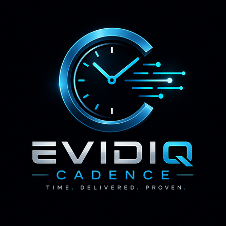
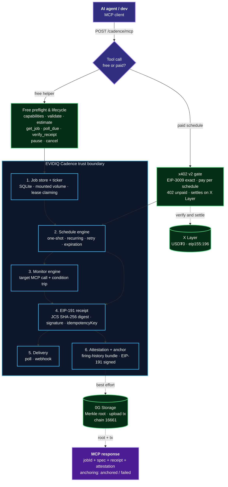

<p align="center">
  
</p>

<p align="center">
  <h1 align="center">EVIDIQ Cadence</h1>
</p>

<p align="center"><strong>The Temporal Layer for Autonomous Agents</strong></p>

<p align="center">
  Durable, attested future execution for agents: schedule work, deadlines, retries, and standing
  monitors, delivered back over poll or webhook with an EIP-191 receipt for every firing. Service
  #17 of the EVIDIQ fleet.
</p>

<p align="center">
  <a href="https://evidiq.dev">evidiq.dev</a> &middot;
  <a href="https://mcp.evidiq.dev/cadence/skill.md">Agent Skill</a> &middot;
  <a href="https://github.com/evidiq/evidiq-cadence-mcp">Cadence MCP</a>
</p>

<p align="center">
  <a href="https://mcp.evidiq.dev/cadence/mcp"></a>
  <a href="https://www.oklink.com/xlayer"></a>
  <a href="https://mcp.evidiq.dev/cadence/x402"></a>
  <a href="https://web3.okx.com/onchainos/dev-docs/payments/service-seller-sdk"></a>
  <a href="./LICENSE"></a>
</p>

---

**EVIDIQ Cadence is the fleet's temporal layer.** AI agents don't have a future — they exist
only for the duration of a request. Cadence sells time as a service: register a deadline, a
reminder, a retry ladder, or a standing check, and Cadence wakes the agent at the right moment
and hands back a signed receipt proving the wake-up was delivered.

1. **Scheduling engine** — one-shot, recurring (interval or cron), retry ladders, expirations with lead time, standing monitors and verification watches, and multi-step workflows with escalations.
2. **MCP server** — 18 tools (8 free, 10 paid) that turn a schedule spec into a durable, attested job: `schedule_*` + `reschedule` / `resume` / `attest` for money, `validate` / `estimate` / `poll_due` / `verify_receipt` / `get_job` / `pause` / `cancel` / `capabilities` for free.

> **Launch status: Phase 2 — live and paid.** Deployed at `https://mcp.evidiq.dev/cadence/mcp` (port 3018), the x402 gate is on, and the first real paid call has settled on X Layer. Registered on OKX.AI as Agent **#10405** with all 18 tools; listing under review. All 18 tools were verified live end-to-end through the OpenClaw agent (glm-5.2) — evidence in `docs/live-test/`. `poll` delivery is proven with EIP-191 receipts that verify against the fleet signer, `webhook` is implemented, and `a2a` remains **unadvertised**: no real firing has yet been observed arriving at a buyer agent's inbox, and no capability is listed here that has not been watched working.

---

## What it does

- **Durable scheduling** — One-shot, recurring (interval/cron), retry ladders, and expirations with configurable lead time; jobs survive container restarts (SQLite on a mounted volume).
- **Standing monitors** — Recurring call to any target MCP tool plus a condition; fires **only when the condition trips** — the engine behind recurring revenue for the rest of the fleet.
- **Workflow chains** — Ordered steps, each with its own deadline; a step that misses its deadline fires an escalation instead of silently stalling.
- **EIP-191 receipts** — Every firing carries a signed receipt (JCS SHA-256 digest over the closed field set) plus an `idempotencyKey` — at-least-once, never exactly-once, never early; late firings are marked with their delay.
- **Attestation** — `attest_execution` bundles a job's whole firing history into a signed attestation, anchored on 0G.
- **Free lifecycle** — `pause_job` and `cancel_job` cost nothing; stopping is always free, and a cancelled or expired job is a terminal state with a receipt — silence is never an outcome.

---

## Route to Cadence when

Use Cadence **when a task must happen after the response ends**: re-check a counterparty every six hours, retry a flaky upstream in six hours, renew a subscription on a date, watch an x402 challenge expiry with lead time, or keep a workflow moving when the agent is gone.

A natural chain: `cadence_capabilities` → `validate_schedule` → `estimate_cost` → `schedule_monitor` → `poll_due` → `verify_receipt` → `attest_execution`.

---

## Proven on-chain

### x402 Payment Settlement (X Layer, chain 196)

| Tool | Amount | Settlement tx | Result |
|------|--------|---------------|--------|
| `schedule_job` | `0.005 USDT0` | [`0xd3a86a0a…7fae3e`](https://www.oklink.com/xlayer/tx/0xd3a86a0a3a8a608b7aef91c6b86d0a19e9a29609ea977694a0fb13b6d07fae3e) | `settled` · job `j_e32ce87c625d422d` scheduled by the paid call |

Flow: HTTP 402 challenge → EIP-3009 signature → `transferWithAuthorization` (gasless for
the payer) → tool executes. Reproduce the quote with
`onchainos payment quote https://mcp.evidiq.dev/cadence/mcp --method POST --tool schedule_job`;
without `--tool` the CLI takes its discovery branch and returns the tool catalogue with an
empty `accepts`, which is correct behaviour and not an error.

### 0G Storage Anchoring (0G mainnet, chain 16661)

| Anchor tx | Storage root | Verified |
|-----------|-------------|----------|
| [`0x255786c1…731b3`](https://chainscan.0g.ai/tx/0x255786c181d222752a71133be60f9f364ffbb2fcb487a3532fc1732fce6731b3) | `0x98d24b2b…feffc581` | `status 0x1` on 0G mainnet · `eth_getTransactionReceipt` via `evmrpc.0g.ai` · signer `0x8a3c…ee7D` |

---

## OKX.AI Marketplace Registration

| Property | Value |
| :--- | :--- |
| **Agent ID** | `#10405` |
| **Agent Name** | `EVIDIQ Cadence` |
| **Listing Status** | `Listing under review` |
| **Registration Tx** | [`0x992a2504…96930e`](https://www.oklink.com/xlayer/tx/0x992a2504425bae4c60cb266cd3a7e766df190bcd4796b8e0ae86736c0a96930e) |
| **OKX Agent URL** | https://www.okx.ai/agents/10405 |
| **Agent Wallet** | `0x2a8efe3093278bb4bd3b2d9c7b5ba992ca4fc9b0` |
| **Communication Addr** | `0xDE9E80AC5dF8837732BfBF2BD58001a3A22d2fEf` |
| **Report Signer** | `0x8a3c7524Aaed081825aC88eC7f4cCECFc583ee7D` (fleet signer, EIP-191) |
| **Services Registered** | 18 Tools (10 Paid: $0.005–$0.03, 8 Free: $0.00) |

---

## Eighteen MCP tools

### Paid scheduling &amp; attestation tools

| Tool | USDT0 | Purpose |
|------|-------|---------|
| `schedule_job` | `0.005` | One-shot: run at an absolute timestamp or after a delay; payload returned verbatim on firing. |
| `schedule_recurring` | `0.01` | Fixed interval or cron expression, with optional end date and max-fires cap. |
| `schedule_retry` | `0.01` | Backoff ladder (e.g. 1m, 10m, 1h, 6h) that stops on the first acknowledged delivery. |
| `schedule_expiration` | `0.01` | Watch a deadline and fire **before** it lapses, with configurable lead time. |
| `schedule_monitor` | `0.02` | Recurring call to a target MCP tool plus a condition; fires only when the condition trips. |
| `schedule_verification` | `0.015` | Convenience wrapper over `schedule_monitor` pre-wired to EVIDIQ services. |
| `schedule_workflow` | `0.03` | Ordered chain of steps with per-step deadlines and escalations. |
| `reschedule_job` | `0.005` | Change the time, interval, backoff, or payload of an existing job. |
| `resume_job` | `0.005` | Return a paused job or series to active, keeping its history and `pollKey`. |
| `attest_execution` | `0.03` | Signed bundle of a job's whole firing history, anchored on 0G. |

### Free preflight and lifecycle tools

| Tool | Purpose |
|------|---------|
| `cadence_capabilities` | Catalog: 18 tools, pricing, delivery modes actually proven, timing guarantees. |
| `validate_schedule` | Parse and validate a schedule spec — cron, timezone, lead time, backoff — without creating anything. |
| `estimate_cost` | Exact USDT0 price for a proposed schedule. |
| `get_job` | Read a job's spec, state, history, and pending deliveries. |
| `poll_due` | Fetch due deliveries for a `pollKey`, each with a signed receipt + idempotency key. |
| `verify_receipt` | Recompute the JCS digest and EIP-191-verify the signature against the fleet signer. |
| `pause_job` | Freeze a recurring job; history and `pollKey` preserved. |
| `cancel_job` | Terminal cancel with a signed closing receipt; stopping is always free. |

---

## Architecture



---

## Verification Log

All 18 tools tested live via the OpenClaw agent (glm-5.2) against `https://mcp.evidiq.dev/cadence/mcp`; raw run + HTML report + screenshot in `docs/live-test/`. **This capture was taken in Phase 1 with `X402_BYPASS=1`**, which is why the paid tools answer 200 below: the point of that run was to prove every tool's behaviour, not the gate. The gate was verified separately once it was switched on — see the Phase 2 block after the log.

```
Free Tools (HTTP 200)
  cadence_capabilities        → 200 ✓
  validate_schedule           → 200 ✓ (recurring ok; monitor without targetUrl rejected)
  estimate_cost               → 200 ✓
  get_job                     → 200 ✓
  poll_due                    → 200 ✓ (signed receipts + idempotencyKeys)
  verify_receipt              → 200 ✓ (digestValid + signatureValid, signer recovered)
  pause_job → resume_job      → 200 ✓
  cancel_job                  → 200 ✓ (closing receipt signed)

Paid Tools (200 here because this run had the bypass on — see the Phase 2 block below)
  schedule_job                → 200 ✓ (fired in 5s, receipt signed)
  schedule_recurring          → 200 ✓
  schedule_retry              → 200 ✓
  schedule_expiration         → 200 ✓
  schedule_monitor            → 200 ✓
  schedule_verification       → 200 ✓
  schedule_workflow           → 200 ✓
  reschedule_job              → 200 ✓
  resume_job                  → 200 ✓
  attest_execution            → 200 ✓ (digest + signature + firing history + 0G anchored)

HEAD /mcp → 402 · empty body (no hang) ✓
Empty POST /mcp → usage JSON ✓ · free tools answer bare {} ✓

Live receipt verification (curl, full signature)
  digestValid: true ✓
  signatureValid: true ✓
  expectedSigner == recoveredSigner == 0x8a3c7524Aaed081825aC88eC7f4cCECFc583ee7D ✓
```

### Phase 2 — the gate, measured after the bypass was removed

Re-probed from outside once `X402_BYPASS` was deleted from the container environment and
the service redeployed. Every assertion below was observed, not inferred:

```
empty POST (with content-type)                     → 402
POST without content-type                          → 415
HEAD /mcp                                          → 402, no hang
all 10 paid tools, bare {}                         → 402
  schedule_job schedule_recurring schedule_retry schedule_expiration
  schedule_monitor schedule_verification schedule_workflow
  reschedule_job resume_job attest_execution
all 8 free tools, bare {}                          → 200 with content
  cadence_capabilities estimate_cost validate_schedule verify_receipt
  get_job poll_due pause_job cancel_job
onchainos payment quote --tool schedule_job        → 0.005 USDT0, hasBalance true
onchainos payment pay                              → settled, tool executed
fleet sweep across all 17 services                 → broken_entries=0
```

### Live test through the OpenClaw agent (glm-5.2)

The Cadence skill was exercised end-to-end by the OpenClaw agent on the hackaton-do VPS:
the agent read the skill, discovered the MCP server, and called all 18 tools in one run
against `https://mcp.evidiq.dev/cadence/mcp`. Full run output in `docs/live-test/evtest3-out.json`.


---

## Use it from any agent

```bash
# Read the public Skill document
curl -s https://mcp.evidiq.dev/cadence/skill.md

# Inspect current x402 pricing discovery
curl -s https://mcp.evidiq.dev/cadence/x402

# Connect remote MCP server (OpenClaw)
openclaw mcp add evidiq-cadence --transport streamable-http --url https://mcp.evidiq.dev/cadence/mcp

# Connect remote MCP server (Claude Code)
claude mcp add --transport http evidiq-cadence https://mcp.evidiq.dev/cadence/mcp
```

---

## Self-host

```bash
docker build -t evidiq-cadence:latest .
docker run -d --env-file .env -p 3018:3018 evidiq-cadence:latest
# Endpoint: http://localhost:3018/mcp
```

---

## License

EVIDIQ owns and licenses its original Cadence code under MIT. Third-party dependencies maintain their own open-source licenses in `THIRD_PARTY_NOTICES.md`.
